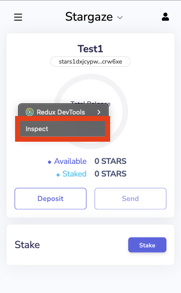
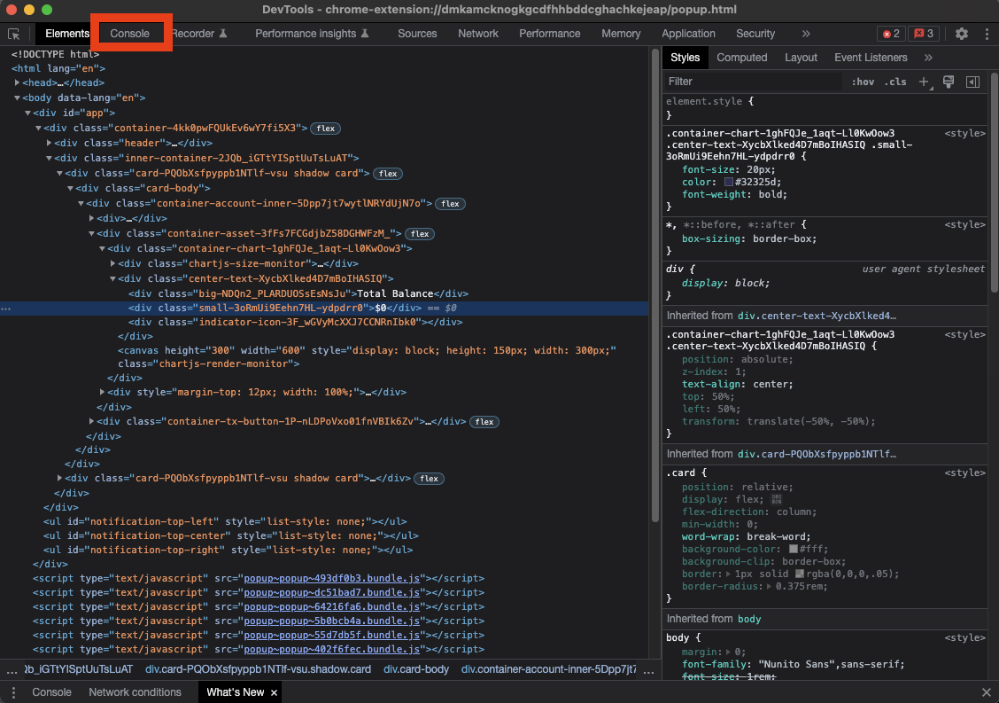
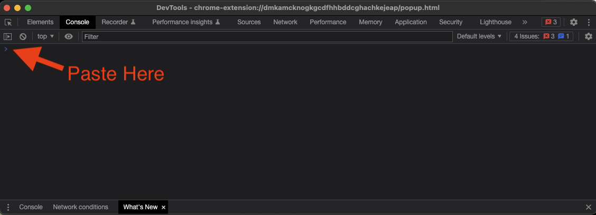
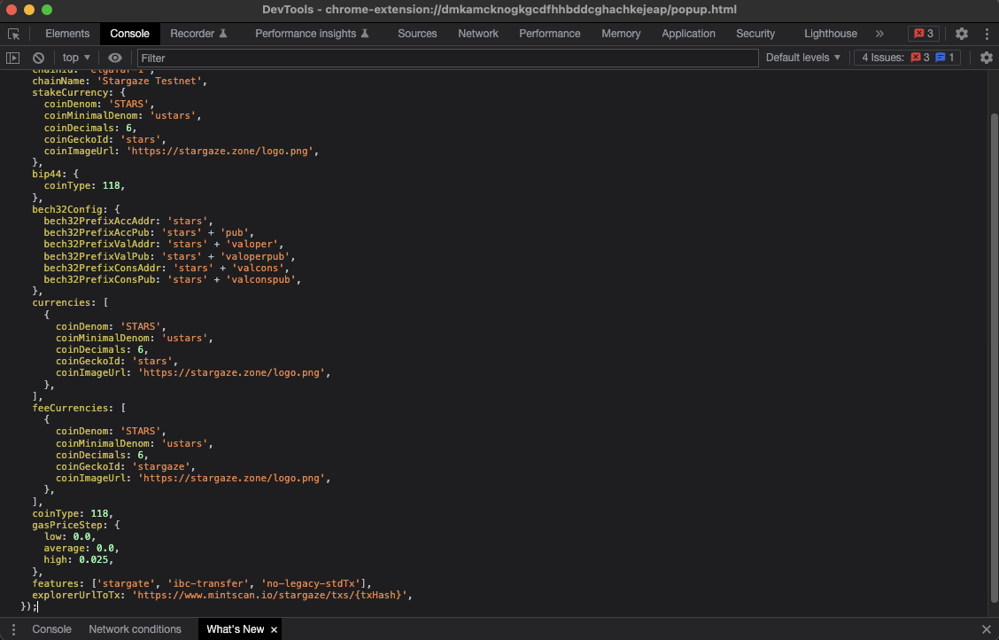
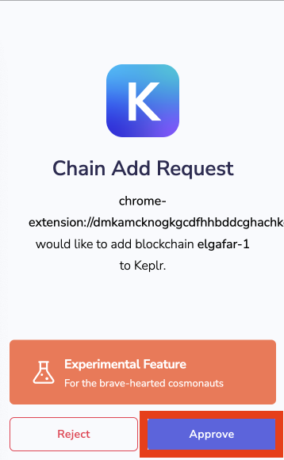
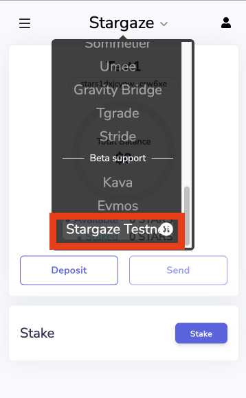
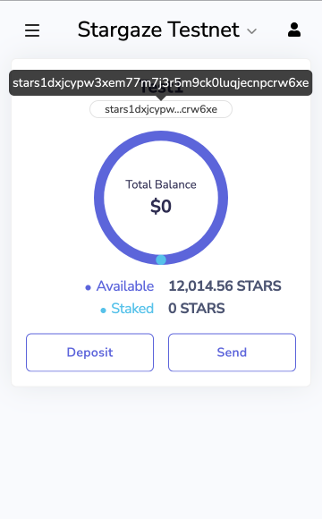

# How to add Stargaze Testnet to wallets

You can follow these steps in Google Chrome, Brave browser, or any other browser which supports wallet extension(Keplr, Cosmostation, Leap, etc).

## Keplr

### 1) Open Keplr wallet, right-click on it, and click on ``Inspect``

This will open ``DevTools`` window.



### 2) On the ``DevTools`` window, click on the ``Console`` tab



### 3) Copy the following code.

```js
window.keplr.experimentalSuggestChain({
  rpc: 'https://joe.rpc.chandrastation.com/',
  rest: 'https://joe.api.chandrastation.com/',
  chainId: 'joe-1',
  chainName: 'Just Joe Chain',
  stakeCurrency: {
    coinDenom: 'JOE',
    coinMinimalDenom: 'ujoe',
    coinDecimals: 6,
    // coinGeckoId: '',
    coinImageUrl: 'https://justjoe.app/keplr-logo.png',
  },
  bip44: {
    coinType: 118,
  },
  bech32Config: {
    bech32PrefixAccAddr: 'joe',
    bech32PrefixAccPub: 'joe' + 'pub',
    bech32PrefixValAddr: 'joe' + 'valoper',
    bech32PrefixValPub: 'joe' + 'valoperpub',
    bech32PrefixConsAddr: 'joe' + 'valcons',
    bech32PrefixConsPub: 'joe' + 'valconspub',
  },
  currencies: [
    {
      coinDenom: 'JOE',
      coinMinimalDenom: 'ujoe',
      coinDecimals: 6,
      // coinGeckoId: '',
      coinImageUrl: 'https://justjoe.app/keplr-logo.png',
    },
  ],
  feeCurrencies: [
    {
      coinDenom: 'JOE',
      coinMinimalDenom: 'ujoe',
      coinDecimals: 6,
      // coinGeckoId: '',
      coinImageUrl: 'https://justjoe.app/keplr-logo.png',
    },
  ],
  coinType: 118,
  gasPriceStep: {
    low: 0,
    average: 0.01,
    high: 0.025,
  },
  features: ['stargate', 'ibc-transfer', 'no-legacy-stdTx'],  
});
```

### 4) Paste the code in the ``Console`` tab



### 5) Press ``Enter``.



### 6) Click ``Approve`` button on Keplr Wallet window



### 7) Close Keplr Wallet and re-open it

### 8) Click on the networks present at top of Keplr Wallet, scroll down, and select ``Just Joe Chain``



### 9) The wallet is ready and you can copy the address

